# Canvas Connect

Welcome to the Canvas Connect project! .This repository features where users can share their art, interact through likes and comments.

## Description

The Canvas Connect application allows users to add, edit, delete and view posts. It is designed to help users organize their posts in one place, making it easy to find and use them when needed.

## Features

- User Registration and Login
- Add new posts with image, title and description
- Edit existing posts
- Delete posts
- View other user posts

## Technologies Used

- **Frontend**: HTML, CSS, JavaScript, EJS
- **Backend**: Node.js, Express.js
- **Database**: MongoDB (or your choice of database)
- **File Upload**: Multer

## Screenshots

To provide a better understanding of the Canvas Connect application, here is a screenshot:

##Main Interface

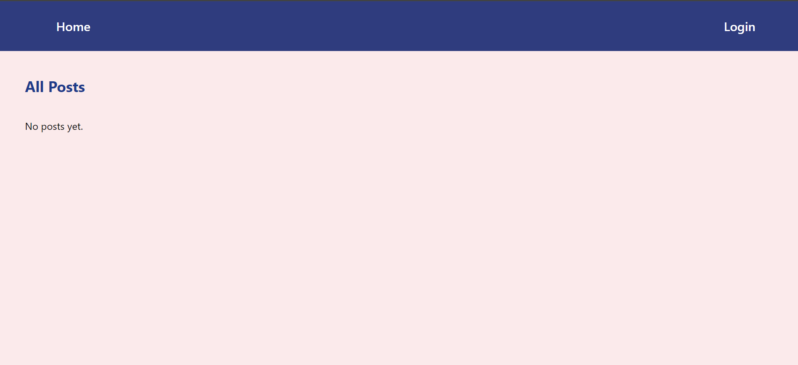

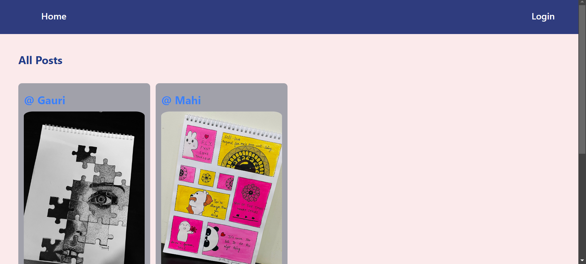

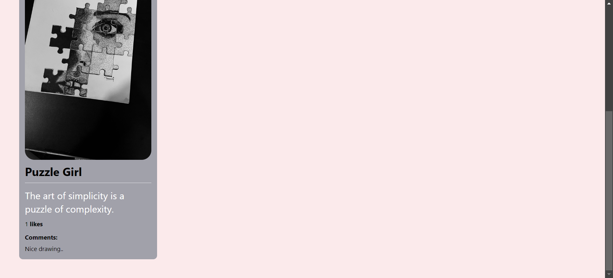

##User One Profile Interface

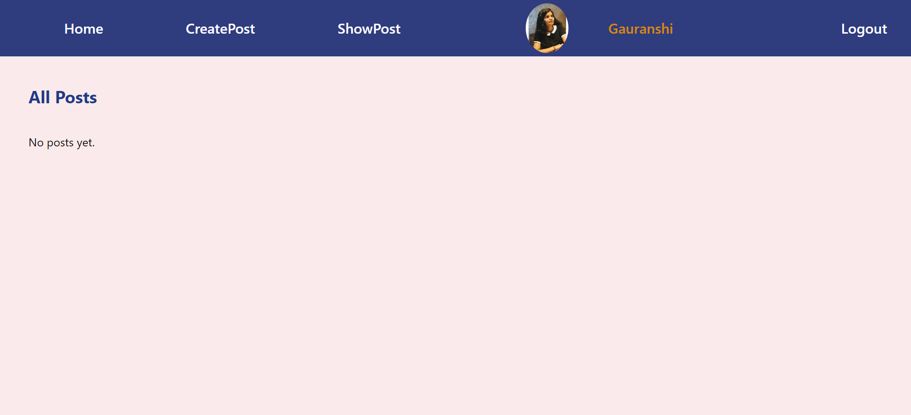

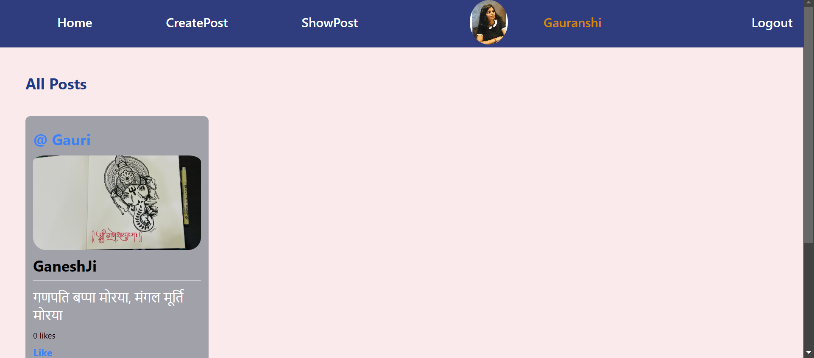

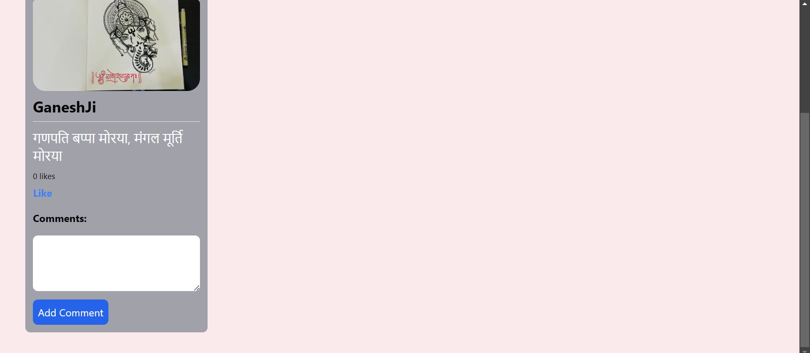

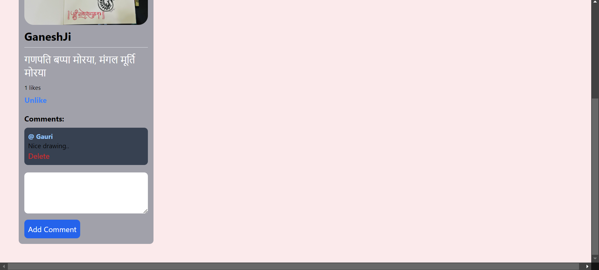

##User Second Profile Interface

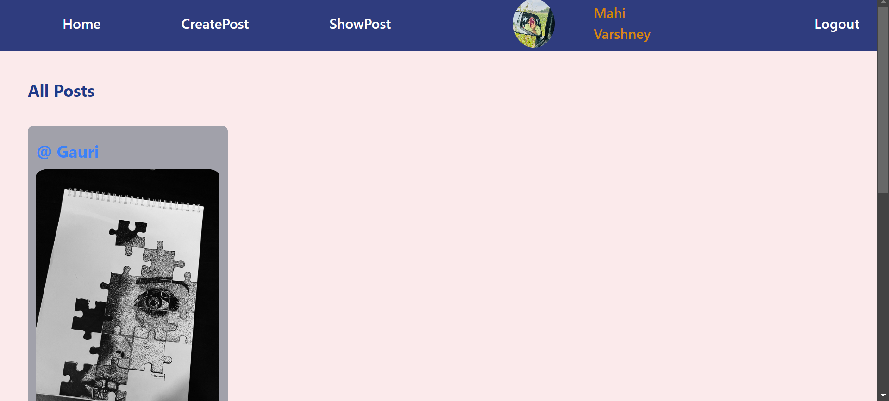

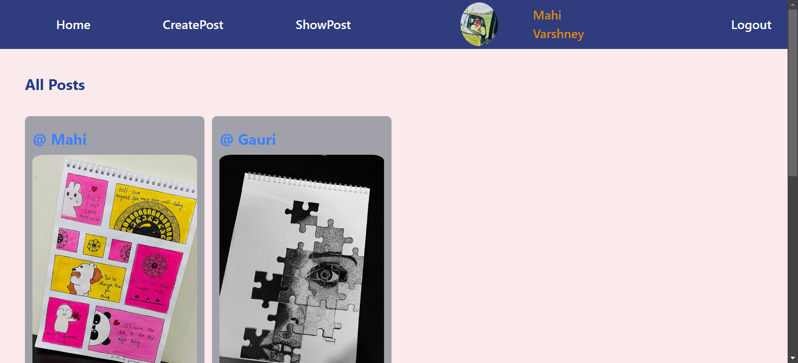

##Login Interface

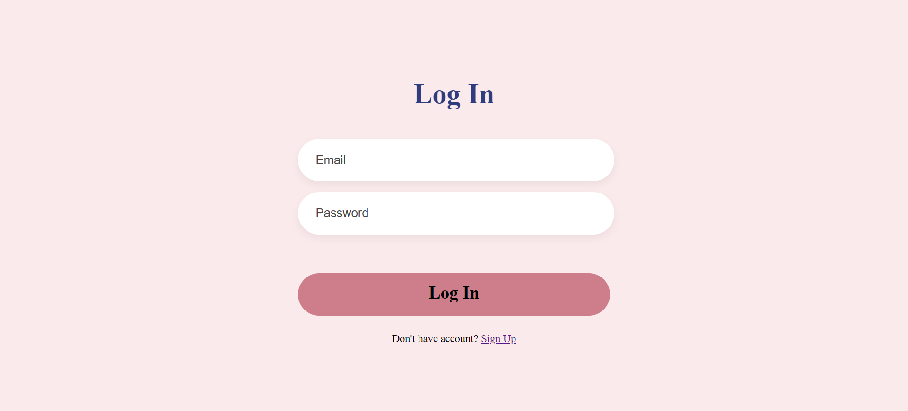

##Signup Interface

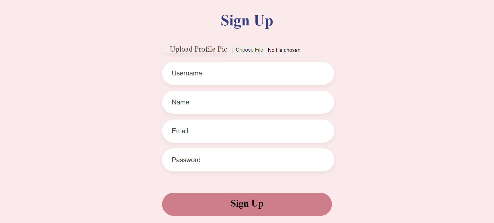

##Create Post Interface

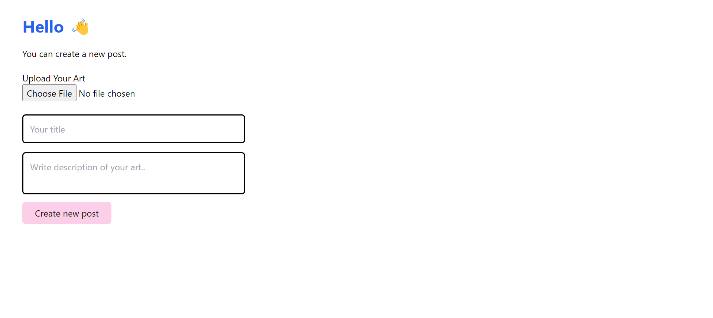

##Your Post Interface

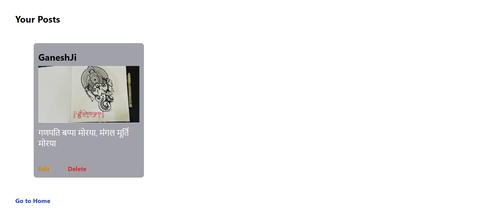

##Update Post Interface

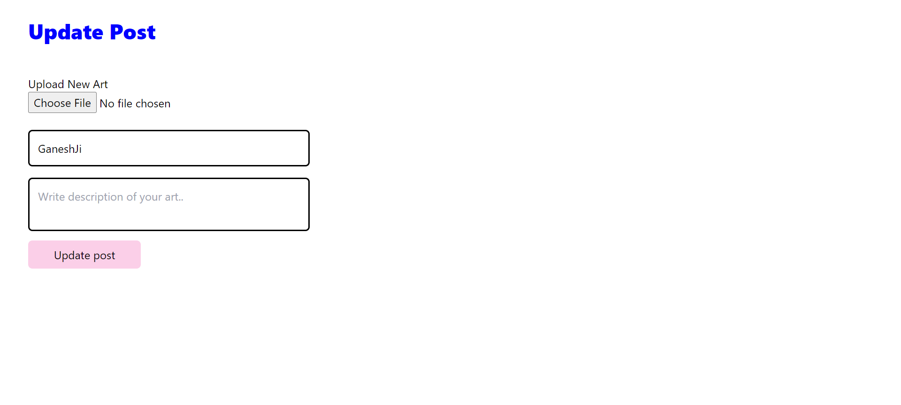

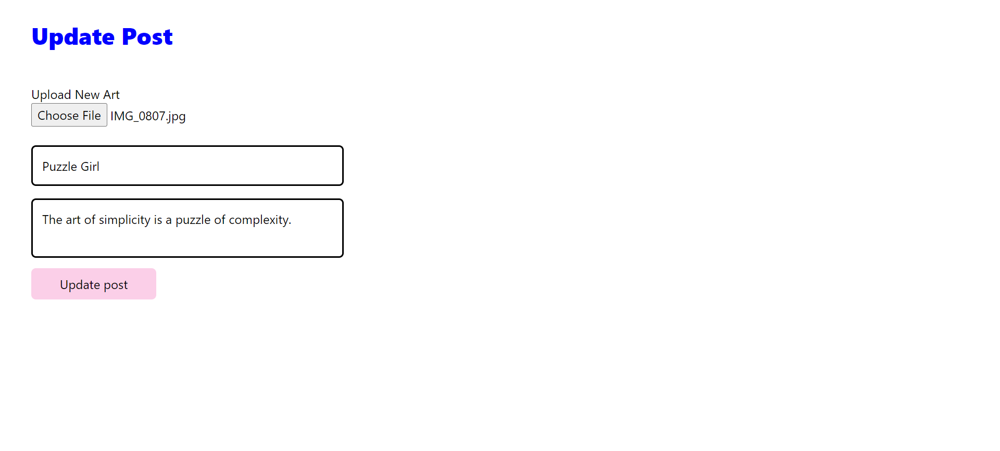

##After Update Post Interface

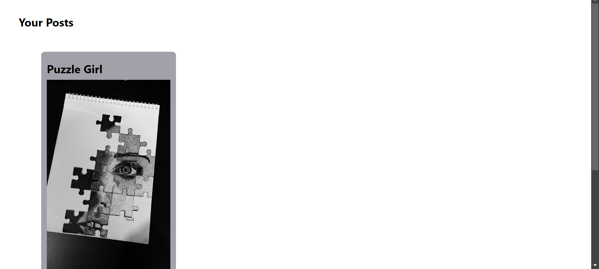

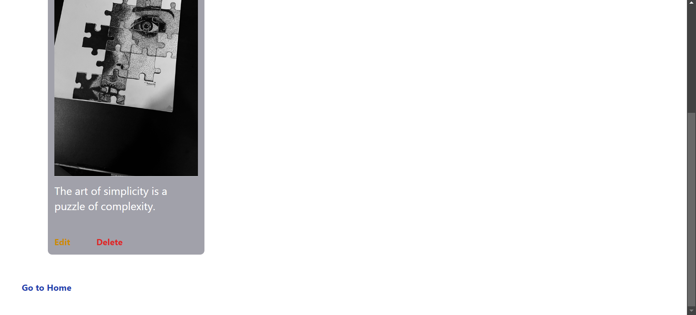

Feel free to customize this template according to your project's specific needs and details!

For any inquiries, please contact:

Name: Gauranshi Varshney
Email: gauranshivarshney@gmail.com
