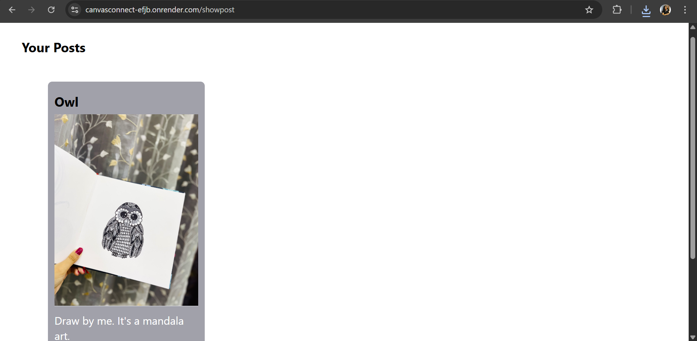
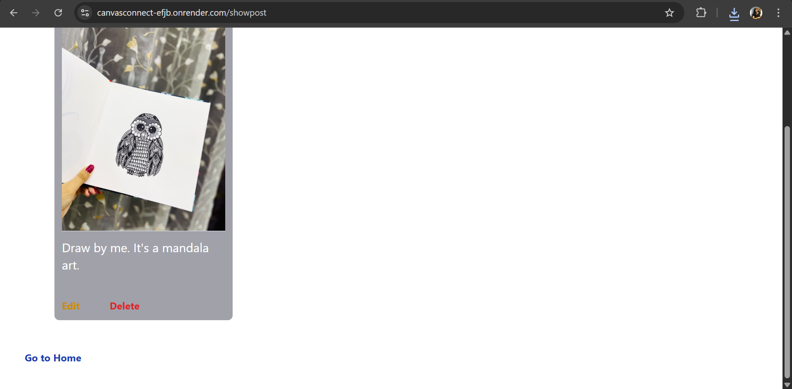
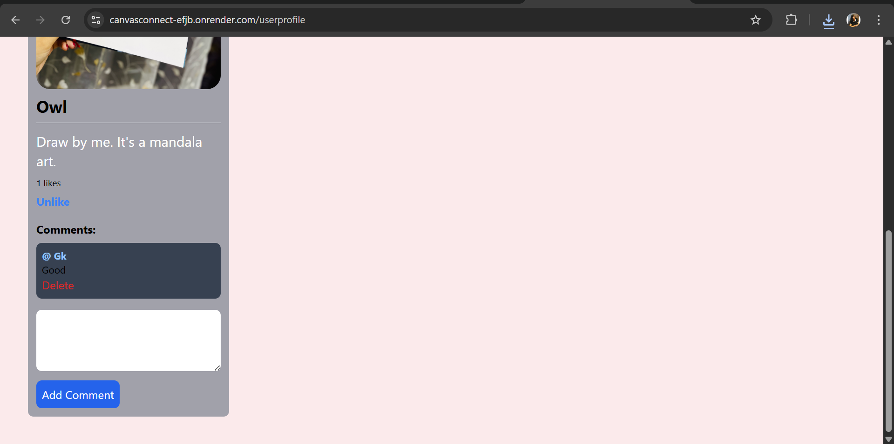
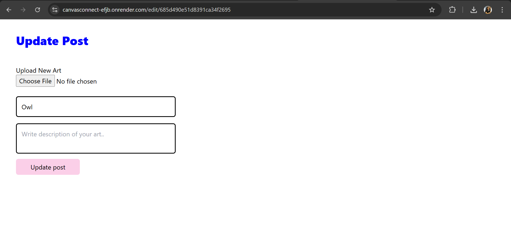
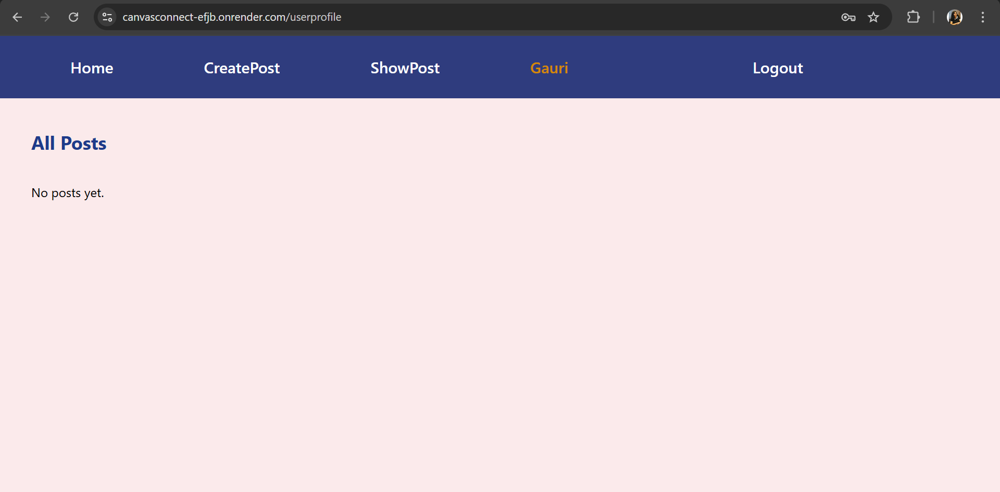
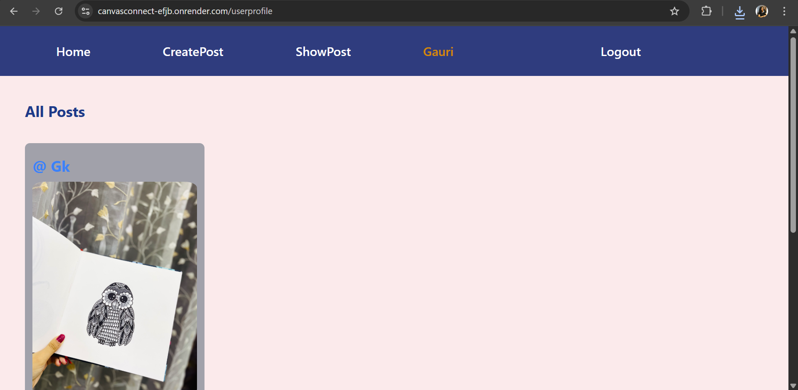
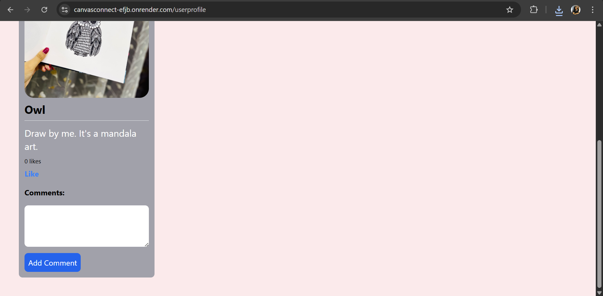

# 🎨 Canvas Connect

Canvas Connect is a Node.js-based social media platform for artists — just like Instagram, but made for sharing your **artwork**. Users can create accounts, post their art with a title and description, interact with others through likes and comments, and manage their posts with full CRUD operations.

---

## 🔗 Live Demo

[👉 View Link ](https://canvasconnect-efjb.onrender.com)

## 🚀 Features

- ✅ User Authentication (Signup, Login, Logout)
- 🎨 Create Art Posts (with Title, Description & Image)
- ❤️ Like & 💬 Comment on Posts
- ✏️ Edit or 🗑️ Delete Your Posts
- 🔐 Secure and Scalable Backend using **Node.js**

---

## 🛠️ Tech Stack

- **Backend**: Node.js, Express.js
- **Database**: MongoDB (via Mongoose)
- **Authentication**: JWT / Sessions
- **Others**: Multer (for image uploads), Bcrypt (for password hashing), dotenv

---

## Screenshots

To provide a better understanding of the Student Study Portal application, here is a screenshot:

##Home Interface

##Login Interface

##SignUp Interface

##CreatePost Interface

##ShowPost Interface

##LikeComment Interface

##Update Interface

##UserProfile Interface

